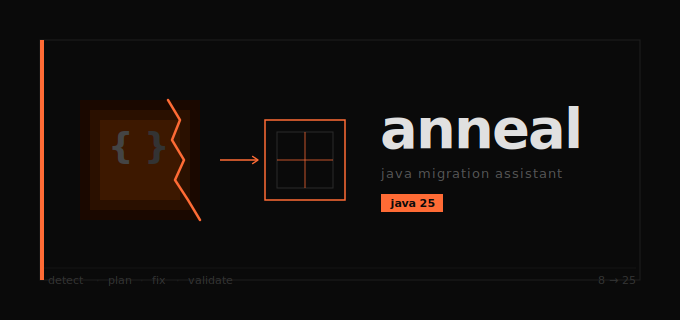

# anneal

> AI-powered Java migration assistant — analyze, plan, and modernize Java codebases to Java 25.

From metallurgy: controlled heating removes brittleness and improves structure. That's exactly what this tool does to a
Java codebase.

---

## what it does

anneal scans a Java repository, detects version-specific risks and breaking changes across the 8→11→17→21→25 LTS path,
and returns a structured migration report with per-finding LLM explanations grounded in your actual source code.

It is a **co-pilot, not an autopilot**. It surfaces, explains, and suggests. The developer decides — and records that decision:

```
PATCH /api/scans/{scanId}/findings/{findingId}
{"status": "ACCEPTED"}
```

```
POST /api/scan
{
  "repoPath": "/path/to/your/java/project",
  "sourceVersion": "8"
}
```

```json
{
  "scanId": "a01f058b-...",
  "detectedVersion": "Java 8",
  "targetVersion": "Java 25",
  "riskScore": 66,
  "riskBand": "HIGH",
  "filesScanned": 1,
  "filesWithFindings": 1,
  "findings": [
    {
      "ruleId": "JPMS_SUN_IMPORT",
      "severity": "BREAKING",
      "effort": "HIGH",
      "filePath": "/path/to/LegacyCode.java",
      "lineNumber": 1,
      "originalCode": "import sun.misc.Unsafe;",
      "referenceUrl": "https://openjdk.org/jeps/261",
      "llmExplanation": "This code pattern is problematic because it uses the sun.misc package, which was not meant for public use and is not part of the JDK API. The suggested fix replaces the import with the public API equivalent, which is safer and more portable. Use --add-exports as a temporary workaround only until the code is updated.",
      "llmProvider": "OLLAMA",
      "llmModel": "codellama:13b",
      "autoApplicable": false,
      "status": "OPEN"
    },
    {
      "ruleId": "DEPRECATION_FINALIZE",
      "severity": "DEPRECATED",
      "effort": "MEDIUM",
      "filePath": "/path/to/LegacyCode.java",
      "lineNumber": 13,
      "originalCode": "protected void finalize() throws Throwable",
      "referenceUrl": "https://openjdk.org/jeps/421",
      "llmExplanation": "The detected code is deprecated since Java 9 because it is not guaranteed to be called by the garbage collector. The suggested fix replaces the implementation with the Cleaner API, which provides a more reliable way to perform cleanup actions when resources are no longer needed.",
      "llmProvider": "OLLAMA",
      "llmModel": "llama3.1:8b",
      "autoApplicable": false,
      "status": "OPEN"
    }
  ],
  "boundaryScores": [
    { "from": "Java 8", "to": "Java 11", "score": 49, "band": "MEDIUM", "findingCount": 4 },
    { "from": "Java 11", "to": "Java 17", "score": 5,  "band": "LOW",    "findingCount": 1 },
    { "from": "Java 17", "to": "Java 21", "score": 12, "band": "LOW",    "findingCount": 2 },
    { "from": "Java 21", "to": "Java 25", "score": 0,  "band": "LOW",    "findingCount": 0 }
  ]
}
```

---

## why it's different

|              | anneal                                           | Generic advice            |
|--------------|--------------------------------------------------|---------------------------|
| Detection    | Deterministic AST traversal — no hallucinations  | Generic warnings          |
| Findings     | Grounded in your actual source code              | Based on general patterns |
| Explanations | LLM-enriched per finding — specific, not generic | One-size-fits-all         |
| Path         | LTS-to-LTS incremental — 8→11→17→21→25           | Big-bang migration        |
| Privacy      | Local-first — Ollama by default, cloud opt-in    | Cloud required            |
| Trust        | Every finding shows rule, JEP link, confidence   | Black box                 |

---

## architecture

```
anneal-core     Pure Java — rule engine, AST scanner, risk calculator. Zero framework deps.
anneal-llm      LangChain4j — fix enrichment (codellama:13b), ONNX embeddings (MiniLM 384-dim)
anneal-store    Quarkus + Panache — PostgreSQL persistence, pgvector similarity search
anneal-api      Quarkus REST — 4 endpoints, CDI wiring, scan orchestration
anneal-ui       Next.js 15 — brutalist dark UI, IBM Plex Mono, molten orange
```

**Detection is deterministic.** The rule engine uses JavaParser AST traversal — it either finds `import sun.misc.Unsafe`
or it doesn't. No LLM involved in detection. LLM only enriches the explanation of what was found and why it matters.

**Local-first.** Ollama runs on your machine. `codellama:13b` for code reasoning, `llama3.1:8b` for prose.
`claude-sonnet-4-6` via Anthropic is available as an opt-in for complex refactors — disabled by default.

**Per-boundary risk scores.** Not one aggregate number — a score per LTS boundary crossing so you know exactly which
step is the most dangerous.

---

## tech stack

| Layer        | Technology                    |
|--------------|-------------------------------|
| Backend      | Quarkus 3.33.1 (LTS)          |
| Language     | Java 25                       |
| AST          | JavaParser 3.28.0             |
| LLM          | LangChain4j 1.13.0            |
| Embeddings   | AllMiniLmL6V2 (ONNX, 384-dim) |
| Vector store | pgvector via Quarkiverse      |
| Database     | PostgreSQL 16                 |
| Frontend     | Next.js 15, TypeScript        |
| Build        | Gradle 9.4.1 (Kotlin DSL)     |
| CI           | GitHub Actions                |

---

## migration coverage

| Boundary | Risk    | Key detections                                                                      |
|----------|---------|-------------------------------------------------------------------------------------|
| 8 → 11   | Highest | `sun.misc.*`, `com.sun.*`, JPMS encapsulation, JAXB/JAX-WS/javax.annotation removed |
| 11 → 17  | Medium  | `--illegal-access` removed, SecurityManager deprecated                              |
| 17 → 21  | Medium  | `Object.finalize()` deprecated, `Thread.stop()` removed                             |
| 21 → 25  | Low     | ThreadLocal → ScopedValue, synchronized → structured concurrency                    |

Plus modernization opportunities at any version: anonymous classes → lambdas, `Date` → `java.time`, `instanceof` cast →
pattern matching, mutable classes → records, platform threads → virtual threads.

---

## getting started

### prerequisites

- Java 25 (Temurin recommended — `sdk install java 25.0.2-tem`)
- Docker (for PostgreSQL + pgvector)
- Ollama with `codellama:13b` and `llama3.1:8b`
- Node.js 20+ (for frontend)

### 1. start the database

```bash
docker compose up -d
```

> If you already have a pgvector/pgvector:pg16 container running on port 5432, skip this step.

### 2. pull models

```bash
ollama pull codellama:13b
ollama pull llama3.1:8b
```

### 3. start the backend

```bash
./gradlew :anneal-api:quarkusDev
```

Flyway runs automatically on startup — schema created, migrations applied.

### 4. start the frontend

```bash
cd anneal-ui
npm install
npm run dev
```

Open `http://localhost:3000`.

### 5. scan a project

```bash
curl -X POST http://localhost:8080/api/scan \
  -H "Content-Type: application/json" \
  -d '{"repoPath": "/path/to/your/java/project", "sourceVersion": "8"}'
```

Or use the UI — enter the repo path, select the source version, hit scan.

---

## configuration

Key settings in `anneal-api/src/main/resources/application.yml`:

```yaml
anneal:
  llm:
    ollama:
      base-url: http://localhost:11434   # point at a remote machine if preferred
      fix-model: codellama:13b
      prose-model: llama3.1:8b
    anthropic:
      api-key: ${ANTHROPIC_API_KEY:}
      model: claude-sonnet-4-6
    allow-cloud-fallback: false          # set true to enable Anthropic for MANUAL findings
    enrichment-enabled: true             # set false for fast offline scans
```

---

## running tests

```bash
./gradlew test                    # all modules
./gradlew :anneal-core:test       # unit tests only
./gradlew :anneal-api:test        # integration tests (requires Docker)
```

38 tests — unit + integration, all passing. Integration tests use a real pgvector postgres instance via Quarkus dev
services.

To validate `claude-sonnet-4-6` explanation quality against the test-legacy fixture:

```bash
ANTHROPIC_API_KEY=sk-ant-... ./gradlew :anneal-llm:test --tests "*CloudModelValidationIT" --info
```

This test is opt-in — skipped automatically when `ANTHROPIC_API_KEY` is not set. It prints explanations from both
local and cloud models side-by-side for manual review.

---

## rule categories

| Category      | Examples                                                                            |
|---------------|-------------------------------------------------------------------------------------|
| `JPMS`        | `sun.misc.*` imports, `sun.misc.Unsafe` usage, illegal reflective access            |
| `API_REMOVAL` | JAXB, JAX-WS, javax.annotation, Thread.stop()                                       |
| `DEPRECATION` | Object.finalize(), SecurityManager                                                  |
| `LANGUAGE`    | Anonymous classes, old DateTime API, instanceof cast patterns, record opportunities |
| `CONCURRENCY` | Platform threads, ThreadLocal, synchronized blocks                                  |
| `BUILD`       | `--illegal-access` flag, javax→jakarta coordinate migration                         |

---

## endpoints

| Method  | Path                                             | Description                       |
|---------|--------------------------------------------------|-----------------------------------|
| `GET`   | `/api/health`                                    | Liveness check                    |
| `POST`  | `/api/scan`                                      | Scan a repository                 |
| `GET`   | `/api/scans`                                     | List all past scans               |
| `GET`   | `/api/scans/{scanId}`                            | Get a specific scan with findings |
| `PATCH` | `/api/scans/{scanId}/findings/{findingId}`       | Update finding status             |

OpenAPI docs available at `http://localhost:8080/q/swagger-ui` in dev mode.

---

## project

Built by [@cloudrishi](https://github.com/cloudrishi) — 20+ years Java/ecommerce, currently building at the intersection
of enterprise Java modernization and applied AI.

Architecture decisions, dependency lessons, and implementation notes are documented
in [ARCHITECTURE.md](./ARCHITECTURE.md).
